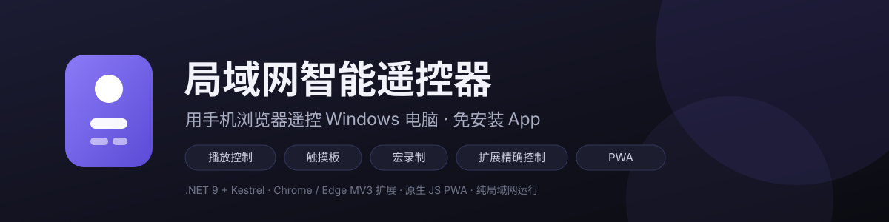
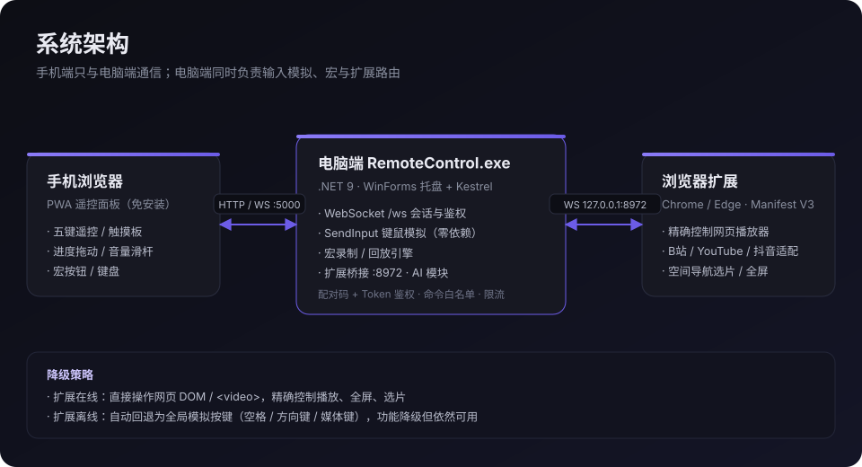
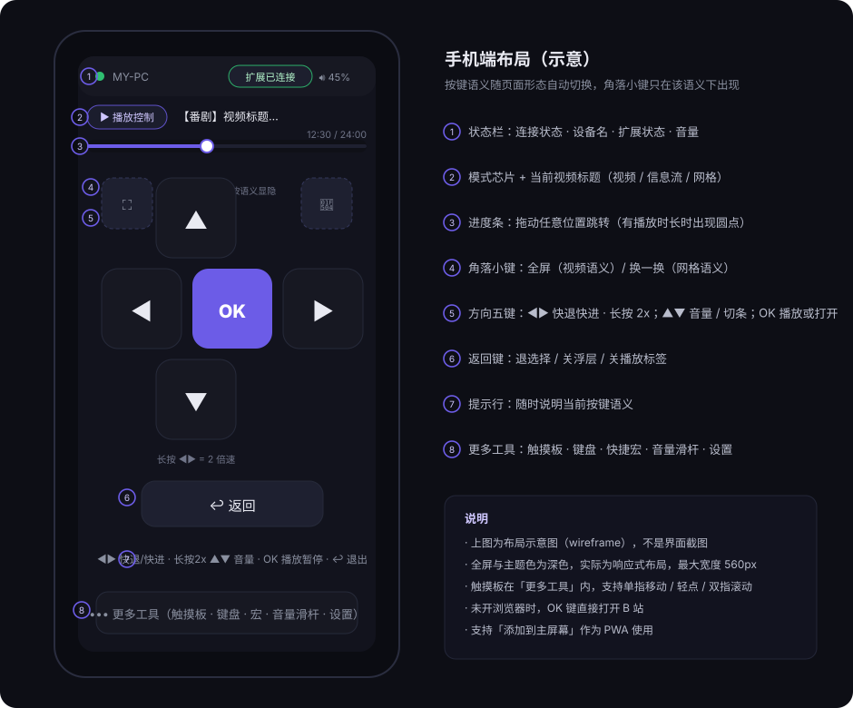

# LAN Smart Remote (Web)

[](LICENSE)
[](https://dotnet.microsoft.com/)
[](#)
[](#)
[](https://github.com/juewee/pCtrl/actions/workflows/build.yml)
[](https://github.com/juewee/pCtrl/releases/latest)

[简体中文](README.md) ｜ **English**



Control a Windows PC from your phone's browser: video playback, mouse/keyboard simulation, one-tap macros. No app to install — run a small program on the PC and open its address on your phone.

> This is an English translation of the [Chinese README](README.md). The UI is currently Chinese-only.

## Features

### Playback control
- Play/pause, next/previous episode, seek ±10s, volume up/down, mute
- **Drag the progress bar** to jump anywhere (a draggable knob appears once a duration is known)
- **Volume slider** for precise 0–100% volume (commands are coalesced while dragging)
- **Fullscreen** (small corner key, video semantics only): clicks the site's own fullscreen button first (so danmaku and controls follow), then falls back to the Fullscreen API / a physical `F` keypress
- **Long-press for 2× speed**: hold the button, release to restore (falls back to holding an arrow key when the extension is offline)
- With the extension online the page's `<video>` element is driven directly; offline, simulated keypresses (space, media keys) are used instead

### TV-style video picking
- D-pad ▲◀▶▼ does **spatial navigation over video cards** on the Bilibili/YouTube home page (purple highlight + auto scroll into view)
- **OK** opens the highlighted video, **↩ Back** goes back; the phone shows the highlighted title
- **If no browser is controllable, OK opens Bilibili** (extension offline → the PC launches the default browser; also applies when the browser is on a non-controllable page)
- Bilibili home **🔄 Refresh feed** (small top-right corner key, grid semantics only) reshuffles recommendations; other sites reload the tab
- The corner keys are intentionally smaller than the D-pad keys to avoid mis-taps, and only appear in the matching context

### Mouse & keyboard
- Touchpad: one-finger move, tap to left-click, two-finger tap to right-click, two-finger scroll, adjustable sensitivity
- Keyboard: shortcuts (Esc/Tab/Enter/arrows/danmaku toggle D/fullscreen F…), text input, key combos such as `ctrl+c`

### Macros
- Record global keyboard/mouse actions into a macro, or edit the JSON by hand
- Replay multi-step sequences with one tap (e.g. "open Bilibili and start playing")
- Create/edit/delete from the phone, effective immediately

### AI natural-language control (server-side only, UI removed)
- Since v1.1.0 the phone UI has no AI input box — the five keys, touchpad and corner keys are faster for everyday use
- The server still ships the `ai_query` command and `AiService`; configure a model and call it over the protocol or from a phone voice assistant
- Built-in Chinese rule parser (works offline) or any OpenAI-compatible endpoint (including local Ollama)
- AI-generated commands go through the same allow-list validation; **see the “AI capability” section for when it is worth enabling**

## Architecture



- The phone only talks to the PC service; the PC is the hub that routes commands, performs local input simulation and forwards extension commands
- When the extension is offline, media commands automatically fall back to simulated keypresses — degraded but still usable
- Runs entirely on the LAN, no external server required

## UI preview



> The image above is a wireframe, not a screenshot. Real screenshots are welcome in `docs/screenshots/`.

## Tech stack

| Part | Technology |
|------|------------|
| PC | .NET 9 (WinForms tray + Kestrel), **zero external NuGet dependencies** (SendInput P/Invoke implemented in-house) |
| Phone | Vanilla HTML/CSS/JS, PWA (add to home screen, Service Worker caching) |
| Extension | Chrome / Edge MV3 (Chromium-compatible), vanilla JS |

## Repository layout

```
pCtrl/
├── server/RemoteControl.Server/     # .NET PC service
│   ├── Program.cs                   # Entry: tray/headless mode, web host
│   ├── Models/                      # Config and message models
│   ├── Services/                    # Dispatcher, SendInput, macros, bridge, sessions, AI, tray
│   └── wwwroot/                     # Phone UI (index.html / css / js / sw.js / icons)
├── extension_v2/                    # Browser extension (manifest.json / background.js / content.js)
├── docs/                            # Architecture and layout diagrams (SVG)
├── .github/workflows/build.yml      # CI: build, publish single-file exe, smoke test, attach to Release
└── README.en.md                     # This file
```

## Getting started

### 0. Download (recommended, no build needed)

Grab `RemoteControl-<version>-win-x64.zip` from [**Releases**](https://github.com/juewee/pCtrl/releases/latest):

- Self-contained single file — **no .NET runtime needed** on the target PC;
- Unzip, keep `RemoteControl.exe` and `wwwroot` in the same folder, double-click the exe (the tray icon shows the pairing code and URL);
- Connect the phone to the same LAN and open that URL in the browser, then enter the pairing code.

To build it yourself, continue below.

### 1. Build the PC service

```powershell
dotnet build server/RemoteControl.Server/RemoteControl.Server.csproj -c Debug
```

Output: `server/RemoteControl.Server/bin/Debug/net9.0-windows/RemoteControl.exe`

### 2. Run it

Double-click `RemoteControl.exe` (tray mode), or for debugging:

```powershell
.\RemoteControl.exe --no-tray
```

The console prints the LAN URL (e.g. `http://192.168.31.46:5000`) and a **6-digit pairing code**.

### 3. Install the browser extension (optional but recommended)

1. Open `edge://extensions` (`chrome://extensions` in Chrome)
2. Enable developer mode → "Load unpacked" → select the `extension_v2/` folder
3. The extension connects to `ws://127.0.0.1:8972` automatically; the phone status bar then shows "extension connected"
4. After changing extension code, click "Reload" on the extension card (or restart the browser)

Temporary alternative (must be re-run after closing the browser):

```powershell
Start-Process msedge.exe -ArgumentList '--load-extension="<your repo path>\extension_v2"'
```

### 4. Connect your phone

1. Open the printed URL in your phone browser (same LAN)
2. Enter the 6-digit pairing code once — the token is persisted, so later connections are automatic
3. Use "Add to Home Screen" for an app-like PWA experience

## Configuration

`config.json` lives next to the exe (generated on first run):

```json
{
  "port": 5000,                      // phone web server port
  "extensionPort": 8972,             // extension bridge port
  "pairingCode": "123456",           // 6-digit code (randomised on first run; keep it private)
  "token": "",                       // issued after pairing (persisted; keep it private)
  "deviceName": "MY-PC",             // name shown in the phone status bar
  "ai": {
    "provider": "none",              // none = built-in rule parser | openai = OpenAI-compatible endpoint
    "baseUrl": "http://127.0.0.1:11434/v1",
    "apiKey": "",
    "model": "gpt-4o-mini"
  }
}
```

`macros.json` stores macro definitions (hand-editable). Step types: `key_press`, `key_combo`, `text_type`, `mouse_move`/`mouse_click`/`scroll`, `browser_action`, `delay`, `execute_macro`.

## Protocol

All WebSocket messages are JSON (camelCase):

```json
{ "id": "1", "type": "command", "action": "play_pause", "payload": {}, "timestamp": 1694070000000 }
```

- The phone connects to `ws://<pc-ip>:5000/ws`; the first message must be `auth` (pairing code or token)
- The PC replies with `response`; extension-pushed `event`s (such as `playback_state`) are broadcast to every phone

### Commands

| Group | Actions |
|-------|---------|
| System | `ping` `get_info` `get_status` `auth` |
| Playback | `play_pause` `play` `pause` `next_episode` `prev_episode` `seek_forward/seek_backward {seconds}` `seek_to {time}` `fullscreen` |
| Browser | `browser_open {url}` (opens in the current tab when the extension is online; launches the default browser when no browser is running) |
| Volume | `volume_up` `volume_down` `set_volume {value}` `mute` |
| Input | `mouse_move {dx,dy}` `mouse_click {button}` `scroll {dy}` `key_press {key}` `key_down/key_up {key}` `key_combo {keys}` `text_type {text}` |
| Extension | `browser_action {action, payload}` (allow-list: play/pause/seek/volume/mute/fullscreen/next_episode/prev_episode/open_url/search/click/get_status/speed_start/speed_stop/tv_nav/refresh_feed) |
| Macros | `macro_list` `macro_execute {macro_id}` `macro_save` `macro_delete` `macro_record_start/stop/cancel` |
| AI | `ai_query {text}` |

## Platform support

- **Bilibili**: bpx player fullscreen button, home video cards, "refresh feed" button, long-press speed, danmaku toggle
- **YouTube**: fullscreen, next episode, spatial navigation (`ytd-*` renderers)
- **Douyin / Xigua and similar**: feed navigation by simulating wheel events
- Everything else: generic `<video>` control

## AI capability (server-side, UI not exposed)

The AI input box was removed from the phone UI in v1.1.0. The server keeps `ai_query` and `AiService` (built-in rule parser + OpenAI-compatible endpoints); set a provider in `config.json` to use it.

**Situations where AI is still worth enabling:**

| Scenario | Example |
|----------|---------|
| Compound commands in one shot | "Open Bilibili and play my watchlist" instead of 5–6 taps |
| Things buttons cannot express | "Search for Jay Chou MVs", "jump to 12:30", "set volume to 35%" |
| Hands busy / screen out of sight | Dictate via phone voice input (driving, cooking, lying down) |
| Local models, private by design | Run Qwen/Llama with Ollama; nothing leaves the LAN |
| Scheduling / automation | Combine macros with AI-generated step sequences |
| Phone assistant integration | Shortcuts / Tasker / Siri → HTTP/WS `ai_query` |
| Shared or elderly use | No need to memorise button semantics |

```json
{ "id": "1", "type": "command", "action": "ai_query", "payload": { "text": "next episode" } }
```

Enable it via `config.json` → `"ai": { "provider": "openai", "baseUrl": "http://127.0.0.1:11434/v1", "model": "qwen2.5:7b" }` (run `ollama serve` first), or point at `https://api.openai.com/v1` with an API key. Without configuration, the built-in rule parser is used and nothing is sent over the network.

## FAQ

**Q: The phone can't open the page after double-clicking the exe?**
The content root is pinned to the exe folder, so a normal double-click works. If you still get 404, make sure `wwwroot` sits next to the exe (do not copy the exe alone).

**Q: Fullscreen sometimes fails?**
Browsers require a user gesture for fullscreen. It usually works if the page was recently interacted with; otherwise the service falls back to a physical `F` keypress (Bilibili/YouTube support it). Worst case, click once on the web page and try again.

**Q: Tapping fullscreen while already fullscreen cancels and immediately re-enters?**
Fixed in v1.1.0. The old implementation treated site-drawn "web fullscreen" as a state to exit before entering real fullscreen, which looked like a cancel-then-enter. Fullscreen is now a strict toggle: if you are in fullscreen (browser or site-drawn), it only exits; otherwise it enters. The extension reports the direction back to the phone, and the PC no longer sends a fallback `F` keypress while the extension is still working.

**Q: The phone keeps showing "extension disconnected"?**
The extension is an MV3 service worker: the browser reclaims it after ~30s idle and the WebSocket drops (that is browser behaviour, not a PC-side failure). Since v1.1.0 the extension sends a 15s heartbeat, the PC detects half-open connections and reports state transitions, and reconnection happens within 0.5–5s. If it still happens often, click "Reload" on the extension card in `edge://extensions`, and make sure the PC service is running.

**Q: The touchpad stops responding (touch drops)?**
Fixed in v1.1.0: (1) missing `touch-action:none` let the browser steal the gesture and fire `pointercancel`; (2) a lost pointerup left stale pointer state that turned a later one-finger drag into two-finger scroll. The touchpad now self-heals its pointer map, never mis-clicks on cancel, coalesces movement every ~30 ms and accumulates sub-pixel deltas; the server rate limit was raised to 60/s.

**Q: The extension won't connect to port 8972?**
Make sure the PC service is running; the bridge only listens on 127.0.0.1, so no firewall setup is needed. Reloading the extension reconnects automatically.

**Q: The phone can't connect?**
Both devices must be on the same LAN; Windows may prompt for firewall access on first run — allow it. Use the IP printed in the console/tray (it changes if your LAN IP changes).

## Security

- Pairing code + token authentication, token persisted to avoid re-pairing
- Command allow-list validation (including AI-generated commands and extension actions)
- Token-bucket rate limiting for high-frequency input (touchpad)
- The extension bridge listens on 127.0.0.1 only; the web server binds to the LAN and is never exposed to the internet
- Pairing attempts are throttled: 5 wrong codes from one client locks it for 60 seconds

---

**Version**: v1.1.0 ｜ **Platform**: Windows 10/11 + Chrome/Edge + modern mobile browsers ｜ Chinese requirements doc: [需求文档.md](需求文档.md)

## License

Released under the [MIT License](LICENSE).